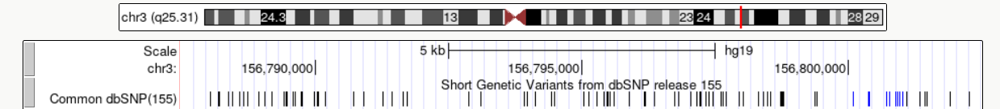
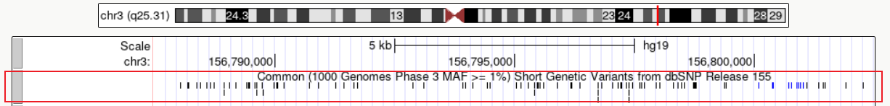
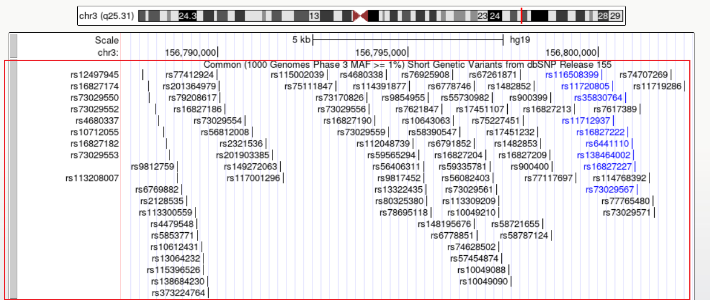
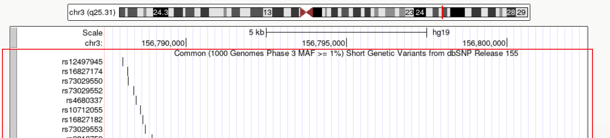
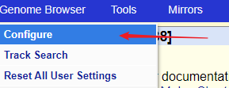
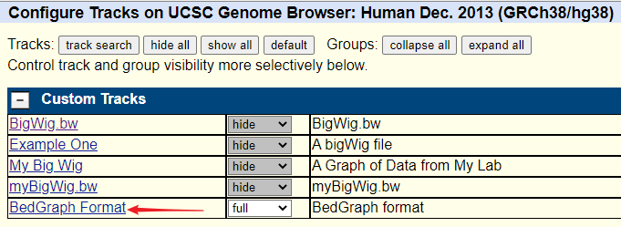
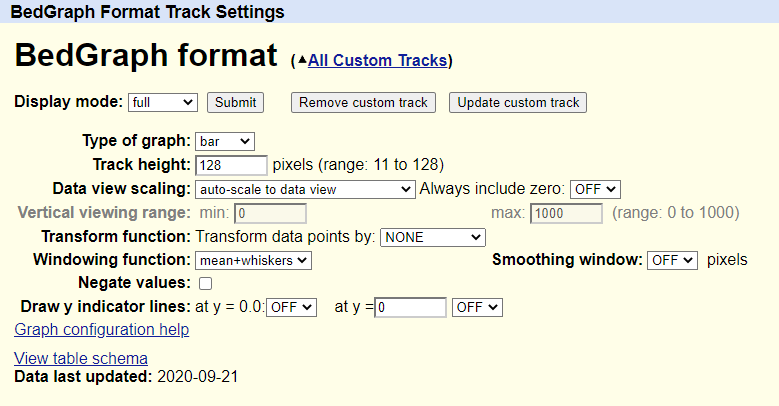

# 利用UCSC Genome Browser展示TP53基因的基因组信息

:::tip
时间⌚ ：2024.9.13  地点🏣：生工r303 
contribute:🙋张顺  💁张文轩 💇刘毅  👧粟钦  🙅刘星  🙇郭永柱  👦陈广广  🙉翁杰  👤张成  👺张茂杰  👵张成 😹黄建鑫
:::

## UCSC Genome Brower简介
UCSC Genome Browser 是一个由加州大学圣克鲁兹分校（University of California, Santa Cruz，简称 UCSC）开发的基因组浏览器，旨在提供对各种物种基因组数据的可视化和访问。这个工具广泛用于基因组学研究，帮助科学家、研究人员和生物信息学家更好地理解基因组数据及其功能。

## **UCSC Genome Browser 的主要特点包括**

-  **数据展示🍃**：

- 提供多种物种的基因组数据，包括人类、小鼠、果蝇等。
- 显示基因组的不同层面，如基因结构、转录组、表观遗传信息等。

-  **功能强大的搜索功能🌘**：

- 可以通过基因名称、位置、功能等进行搜索，快速定位感兴趣的基因或区域。
- 支持使用自定义数据集进行浏览和分析。

## 使用 UCSC Genome Browser 的步骤：🍨 
###  介绍UCSC

[点击打开 UCSC Genome Browser 网站](https://genome.ucsc.edu)

## 轨道显示模式

UCSC基因组浏览器是以轨道为单位来展示不同基因组信息的，一共包括5种不同的展示方式：
hide,dense,squise,pack,以及full,在轨道的右侧右击即可进行不同的设置，不同的展示效果如下⏬ 

 ### dense
 将所有信息浓缩为一行
 

 ### squise
 与pack类似，高度只有pack的一半
  

  ### pack
  每一项都单独显示，但会尽力合理的安排空间
  
  ### full
  完全展开，显示每个注释功能关联的wiggle值，从而创建类似直方图的图像
   

   ### 配置UCSC
 

   ### 2、进入配置页面：

点击刚刚运行的文件 BedGraph Format
 

### 轨迹配置页面
 

 :::danger
 Type of graph ：默认以bar，条形图来显示，选择point会以点或线来显示
Track height ：设置图形高度，像素为单位
Data view scaling (boxed in red) ：
如果选中 use vertical viewing range setting选项，将使用 Vertical viewing range设置中指定的参数显示数据
 :::

**选择物种和基因组版本**：

- 从下拉菜单中选择感兴趣的物种和基因组版本。

**进行搜索**：
## TP53基因在UCSC上的展示
[点击跳转p53](https://genome.ucsc.edu/cgi-bin/hgSearch?search=TP53&db=hg38)
- 使用基因名称或位置进行搜索，定位到感兴趣的区域。
 

**浏览和分析数据**：

 

 **染色体**
  

**导出数据**：

- 可以将浏览的数据导出用于进一步的分析或共享。

## TP53基因的概述
:::danger
基因背景👀  
位置：TP53 基因位于人类第17号染色体的短臂（17p13.1） 
编码蛋白质：TP53 基因编码的蛋白质称为 p53，是一个转录因子。
:::

:::info
🔢
细胞周期调控：p53 蛋白质在细胞周期的调控中起关键作用，特别是在 G1 期和 S 期之间。） 
DNA 损伤响应：当 DNA 受到损伤时，p53 可以暂停细胞周期，允许修复机制修复损伤。 
抑制肿瘤：p53 蛋白被称为“基因组守护者”，它帮助防止细胞发生突变和癌变。TP53 基因突变与多种癌症相关，包括乳腺癌、肺癌和结肠癌等。 
TP53 突变：TP53 基因的突变是许多肿瘤的常见特征，这些突变通常导致 p53 蛋白功能丧失或功能异常 
:::

## TP53的功能应用

1. 癌症诊断与预后:🔝 
检测 TP53 突变可以帮助诊断某些癌症，并为患者的个体化治疗提供重要信息。

2. 遗传性癌症综合症的管理:🔝
TP53 基因突变与利赫-弗劳门综合症相关，这是一种遗传性癌症综合症。通过基因检测， 
可以识别携带 TP53 突变的高风险个体，实施早期监测和干预。

3. 治疗策略开发:🔝
基因治疗：研究人员正在开发基因治疗技术，旨在恢复 TP53 功能或修复 TP53 突变 
小分子药物：一些小分子药物被开发用于恢复突变型 p53 蛋白的功能。 

## 分析于解读
:::tip
1、TP53基因突变在多种癌症中极为常见，几乎出现在所有类型的恶性肿瘤中。 
据统计，在所有人类癌症中，TP53基因的突变率高达50%以上。这种突变不仅限于特定类型的癌症，还广泛存在于卵巢癌、食道癌、结直肠癌、头颈癌、喉癌和肺癌等，发生率在38%-50%之间。 
TP53基因的突变类型多样，包括错义突变、插入或缺失等，其中错义突变主要集中在密码子125和300之间的DNA结合结构域。

:::

## 应用与前景
:::danger
2、通过UCSC Genome Browser，研究人员可以直观地查看TP53基因的结构、变异和功能注释，从而更好地理解其在癌症发生发展中的作用。 
此外，该平台还支持对TP53基因数据的深入分析，为癌症的诊断、治疗和研究提供重要信息。 
随着基因组学和生物信息学的发展，UCSC Genome Browser在癌症研究领域的应用前景将更加广阔。
:::