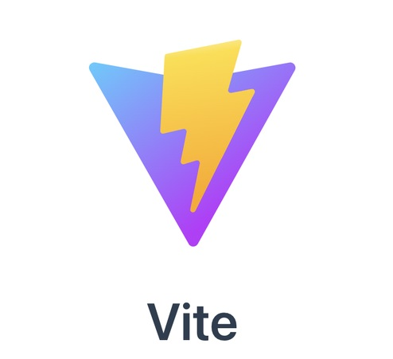

---
# https://vitepress.dev/reference/default-theme-home-page
layout: home

hero:
  name: "戴森球的博客"
  text: "Let’s build from here"
  tagline: 每一行代码都是改变世界的力量
  image:
   src: /mylogo.png
   alt: 头像
  actions:
    - theme: brand
      text: 进入博客
      link: /myfeeling
    - theme: alt
      text: 开始学习
      link: /markdown-examples


---


<div class="marquee-container">
  <div class="marquee">
    
    
    
    
    
    
    
    
    
    
    
    
    
    
   
    
  </div>
 
</div>

<style>
.marquee-container {
  position: relative;
  overflow: hidden;
  background: #f0f0f0;
  height: 150px; /* 图片高度 */
  width: 100%; /* 宽度设为 100% 占据父元素 */
}

.marquee {
  display: flex;
  align-items: center;
  justify-content: flex-start;
  position: absolute;
  top: 0;
  animation: marquee 12s linear infinite;
}

.marquee-image {
  margin-right: 10px; /* 图片间隔 */
  width:150px;
  height: 100%; /* 使图片高度与容器相同 */
}

@keyframes marquee {
  from {
    transform: translateX(100%); /* 从右边开始 */
  }
  to {
    transform: translateX(-100%); /* 向左边滚动 */
  }
}
</style>

:::danger
 📊hello world,I an daisenqiu!,🎓我来自贵州医科大学,📋我在海康威视做前端实习生,👀我喜欢骑行🚴打篮球🏀<br>
 📙分享学习笔记，前端，后端，数据库,👾记录面试,✅写一些我的碎碎念<br>
 ⚠️我将持续施工...,🎠26届的牛马,😭在象牙塔中也要与时代共同进步<br>
:::
:::tip
怎么联系我?
⛄[gitee](https://i.csdn.net/#/user-center/profile?spm=1001.2101.3001.5111)
❄️[github](https://github.com/daisenqiu399)
💃[CSDN](https://blog.csdn.net/2201_75919511?type=blog)
🐭 [稀土掘金](https://juejin.cn/user/3661827143369704)
:::

 
<!-- <video width="100%" height="auto"  autoplay muted controls>
  <source src="./public/lv_0_20240910214339_compressed.mp4" type="video/mp4">
  Your browser does not support the video tag.
</video> -->

```md
<!DOCTYPE html>
<html lang="en">
<head>
    <meta charset="UTF-8">
    <meta name="viewport" content="width=device-width, initial-scale=1.0">
    <title>Hello, World!</title>
</head>
<body>
    <h1>Hello, World!</h1>
</body>
</html>
```


<div style="display: flex; align-items: center; justify-content: center; margin-top: 10px;">
  
  <a href="https://beian.mps.gov.cn/#/query/webSearch?code=52050202001586" rel="noreferrer" target="_blank" style="color: inherit; text-decoration: none; margin-right: 20px;">贵公网安备52050202001586</a>
  <a href="https://beian.miit.gov.cn/#/Integrated/recordQuery" rel="noreferrer" target="_blank" style="color: inherit; text-decoration: none;">黔ICP备2024036495号</a>
</div>


<code-rain />